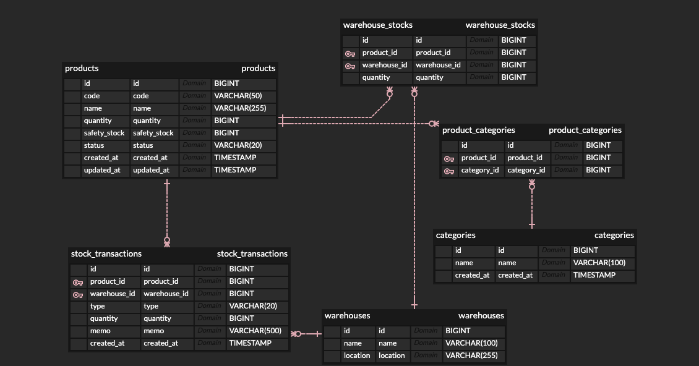

# 재고 관리 시스템 (Inventory Management System)

상품의 입고/출고/재고 조회를 위한 RESTful API 서버입니다.

## 기술 스택

- **Language**: Java 17
- **Framework**: Spring Boot 3.3.5
- **Database**: PostgreSQL
- **ORM**: Spring Data JPA
- **API 문서**: SpringDoc OpenAPI (Swagger)
- **Build Tool**: Gradle 8.10
- **Test**: JUnit 5, Mockito, AssertJ

## 프로젝트 구조

```
inventory-system/
├── inventory-domain/    # 순수 도메인 (엔티티, 도메인 로직)
├── inventory-core/      # 공통 관심사 (예외 처리, 응답 포맷)
├── inventory-api/       # API 계층 (Controller, Service, Repository, DTO)
└── ddl.sql              # 데이터베이스 스키마
```

### 모듈별 책임

| 모듈 | 책임 | 
|------|------|
| `inventory-domain` | 엔티티, 도메인 로직, 비즈니스 규칙 | 
| `inventory-core` | 공통 예외, 에러 코드, API 응답 래퍼 | 
| `inventory-api` | REST API, 서비스, 리포지토리, 설정 | 

## API 명세

| Method | URI | 설명 |
|--------|-----|------|
| `POST` | `/api/products/inbound` | 입고 처리 (미등록 상품 자동 등록) |
| `POST` | `/api/products/outbound` | 출고 처리 |
| `GET` | `/api/products/{id}/stock` | 상품별 재고 조회 |
| `GET` | `/api/products` | 전체 상품 재고 목록 조회 |
| `GET` | `/api/products/{id}/transactions` | 입출고 이력 조회 |

> Swagger UI: http://localhost:8080/swagger-ui.html

## 실행 방법

### 1. 애플리케이션 실행 (H2)

```bash
./gradlew :inventory-api:bootRun
```

> H2 콘솔: http://localhost:8080/h2-console (JDBC URL: `jdbc:h2:mem:inventory`)
> JPA가 테이블을 자동 생성하고, 시드 데이터(data.sql)가 자동 삽입됩니다.

### 2. 테스트 실행

```bash
./gradlew test
```

## 설계 결정 사항

### 동시성 제어
과제 요구사항인 "동시 요청에 대한 안정적인 처리"를 위해 비관적 락(`SELECT ... FOR UPDATE`)을 적용했습니다.
재고 수량의 음수 방지는 도메인 로직과 DB CHECK 제약조건으로 이중 검증합니다.

### 입출고 이력
모든 입고/출고 행위를 `StockTransaction`에 기록하여 재고 변동 추적이 가능합니다.

### 도메인 로직
재고 증감 로직은 `Product` 엔티티에 위치하여 서비스 계층을 얇게 유지했습니다.

## 테스트

| 위치 | 파일 | 설명 |
|------|------|------|
| `inventory-domain` | `ProductTest` | 상품 생성, 입고, 출고 도메인 로직 검증 |
| `inventory-api` | `StockServiceTest` | 입고/출고/조회 서비스 로직 단위 테스트 |
| `inventory-api` | `ConcurrencyTest` | 동시 입고/출고 정합성, 초과 출고 차단, TPS 측정 |

## 확장 포인트

현재 MVP는 `products`, `stock_transactions` 테이블로 구현했으며, 향후 아래 구조로 확장을 고려했습니다.



- **상품 코드(SKU)**: 바코드/QR 스캔 기반 상품 식별
- **안전 재고(Safety Stock)**: 최소 보유 수량 설정 및 재고 부족 알림
- **카테고리**: 상품 분류 (M:N 관계)
- **다중 창고**: 창고별 재고 관리 (Product × Warehouse)